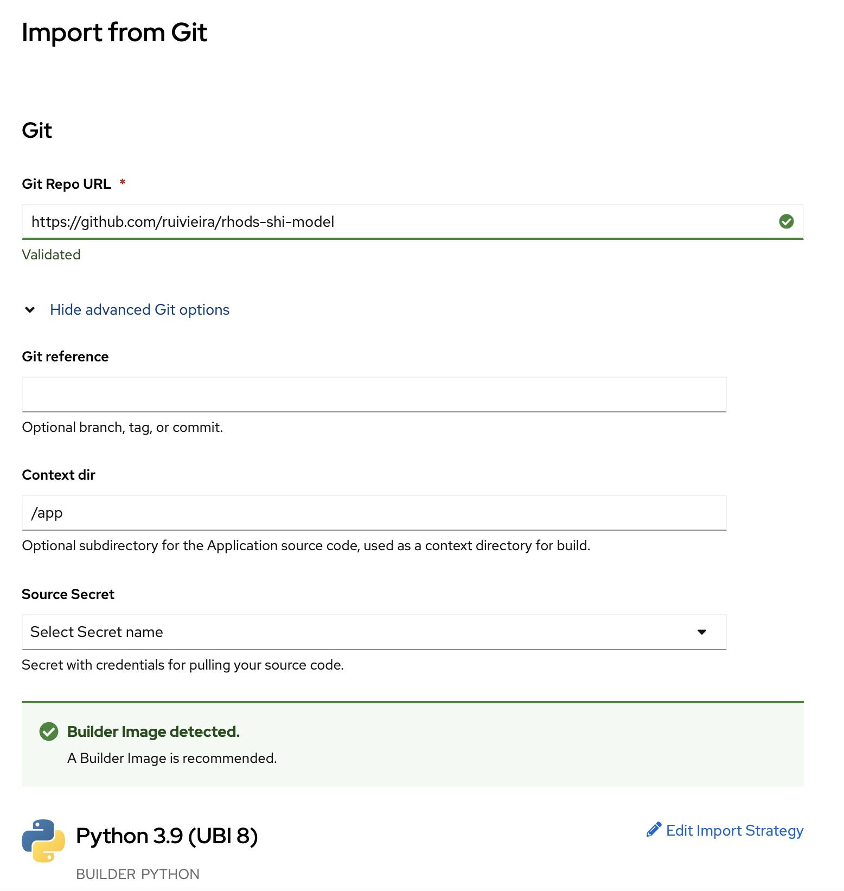

# rhods-shi-model

## Training the model

From Red Hat Open Data Science (RHODS), clone this project
and run the [Jupyter notebook](notebooks/model-training.ipynb).

The last cells will save the model in the `joblib` format under `./app/models`.

## Deploying the model

From OpenShift, add the application from Git and select `/app` as the context.


## API

Assuming the route `$ROUTE` to the service, request predictions using

```shell
curl -X POST --location "$ROUTE/predict" \
    -H "Content-Type: application/json" \
    -d '{
           "specversion": "1.0",
           "id": "667e258a-8eb9-43b2-9313-22133f2c717e",
           "source": "example",
           "type": "org.drools.model.HostLoad",
           "datacontenttype": "application/json",
           "time": "2021-12-03T12:34:56Z",
           "obclienturi": "http://host.docker.internal:3246",
           "data": {
               "host": "hostA",
               "currentLoad": 90.0
           }
        }"
```